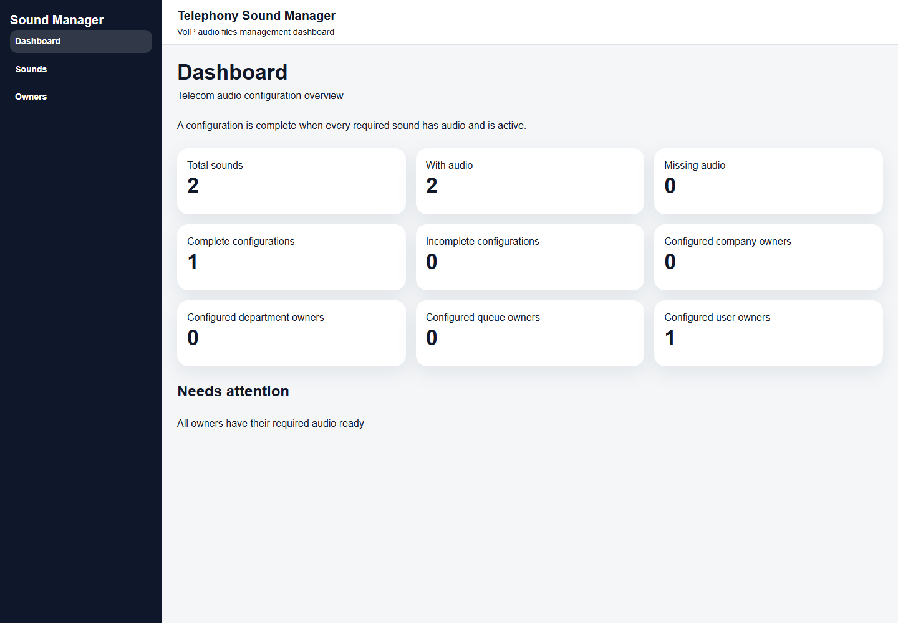
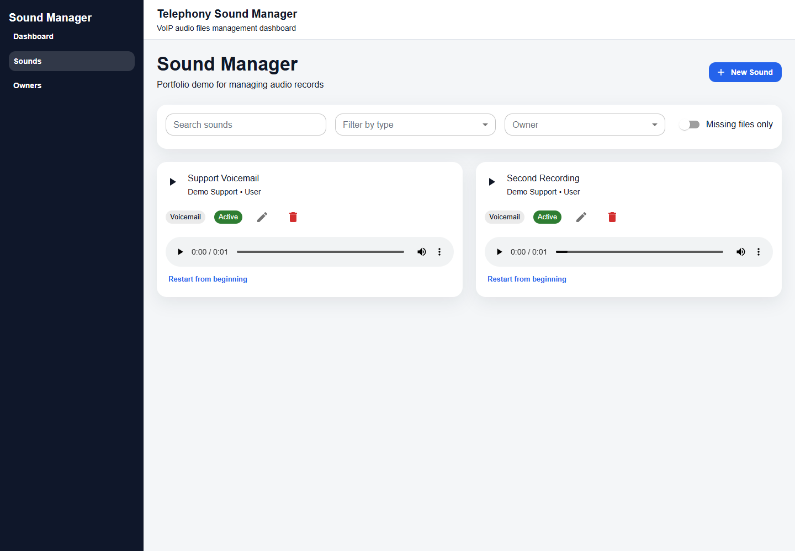

# Telecom Sound Manager

A portfolio React application for managing telecom audio records and checking whether companies, departments, queues and users have their required audio configured. This is a demonstration project, not a connected telephone system.

## Live Demo

Deployment URL: to be added after publishing.

## Features

- Dashboard with audio totals, complete configurations and actionable missing-setup items.
- Create, edit and delete sounds; filter by owner, type, name and missing audio.
- Upload, replace and remove MP3, WAV and OGG files up to 5 MB.
- Audio preview in cards and forms with native playback controls, restart, error feedback and one active player at a time.
- Owner setup checklists: required sounds must exist, contain audio and be active.
- Automatic inactive drafts for records without audio.
- Storage cleanup after replacement/deletion and failed saves, with separate cleanup warnings.
- Responsive layout and shared notifications, loading and error states.

Phone recording is a UI simulation; displayed dial codes do not connect to a PBX. Owner management and authentication are not implemented.

## Screenshots

The browser smoke script generates screenshots using synthetic demo records:




[Edit form](docs/screenshots/edit-sound.png) · [Mobile Owners page](docs/screenshots/owners-mobile.png)

## Stack

React 19, TypeScript (strict), Vite, Material UI, Sass, Redux Toolkit / RTK Query, React Router and Supabase Database / Storage. Tests use the Node.js test runner without additional dependencies.

## Local setup

Use Node.js 22.18+ (Node.js 24 recommended).

```sh
npm ci
```

Copy `.env.example` to `.env.local` and fill in your demo project's public configuration:

```dotenv
VITE_SUPABASE_URL=https://your-project.supabase.co
VITE_SUPABASE_PUBLISHABLE_KEY=your-publishable-key
```

Never put a secret/service-role key in a `VITE_` variable: these values are included in the browser build. Local environment files are ignored by Git.

```sh
npm run dev
```

Open the address printed by Vite, usually http://localhost:5173. In Windows PowerShell, use `npm.cmd` if execution policy blocks `npm.ps1`. Restart Vite after changing environment variables.

The app requires existing `owners` and `sounds` tables matching the database types in `src/features/*/model/dbTypes.ts`, and a public `sounds` Storage bucket. This repository does not yet provide database migrations or seed SQL. Configure table and Storage access in your dedicated Supabase demo project; see [deployment notes](docs/DEPLOYMENT.md).

## Commands

| Command | Purpose |
| --- | --- |
| `npm run dev` | Development server |
| `npm test` | Domain and audio-save regression tests |
| `npm run lint` | ESLint |
| `npm run typecheck` | TypeScript project checks |
| `npm run build` | TypeScript checks and production build |
| `npm run preview` | Preview `dist` locally |
| `node --env-file=.env.local scripts/check-supabase.mjs` | Read-only API connectivity check |
| `node scripts/browser-smoke.mjs` | Browser checks with synthetic API fixtures; run after build |

Browser checks use an installed Chrome at its default Windows path. Set `BROWSER_PATH` for another Chromium executable. They intercept external requests, never write to Supabase, and save screenshots under `docs/screenshots`. They need permission to launch a headless browser and bind a local preview port.

## Architecture

```text
src/
  app/                    Routing, store, theme and UI state
  features/
    dashboard/            Derived overview and missing-setup navigation
    owners/               Owner views and required-audio business rules
    sounds/               Forms, validation, API, mapping and Storage operations
  shared/
    api/                  Supabase client
    layout/               Application navigation and layout
    ui/                   Reusable presentation components and audio player
    utils/                Error extraction
```

Forms, domain objects and database rows are separate models. Mappers translate between them. RTK Query caches owner/sound queries across pages. Dashboard statistics reuse the same owner-setup rules as the Owners page.

## Deployment and verification

[Vercel deployment instructions and manual checks](docs/DEPLOYMENT.md) cover environment variables, Supabase permissions, Storage cleanup limitations and verification scenarios. `vercel.json` provides SPA fallback for direct navigation and refresh on nested routes.

Publishing the frontend does not establish safe database permissions. Choose a read-only or explicitly disposable editable demo before sharing it publicly. The existing app has no authentication.
